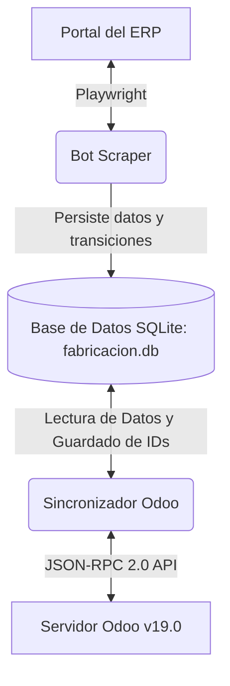
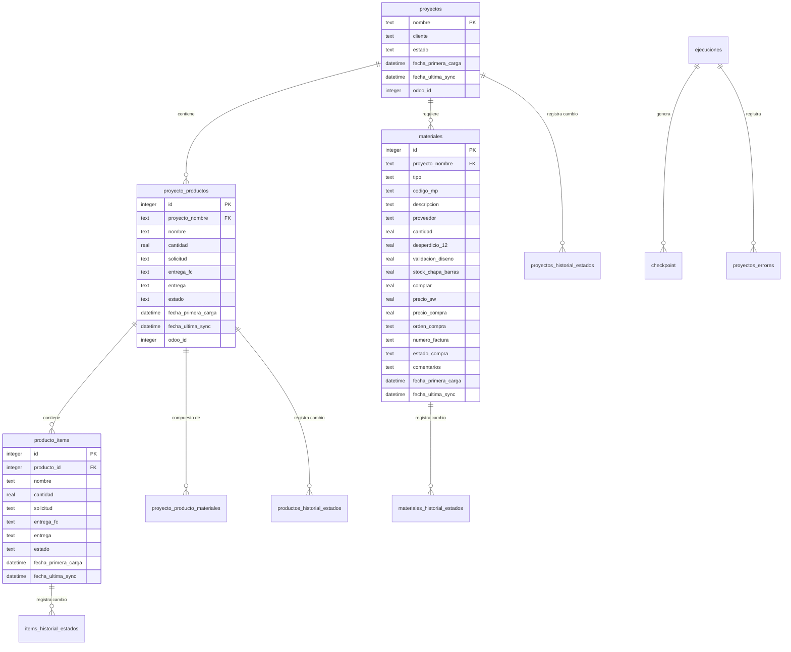
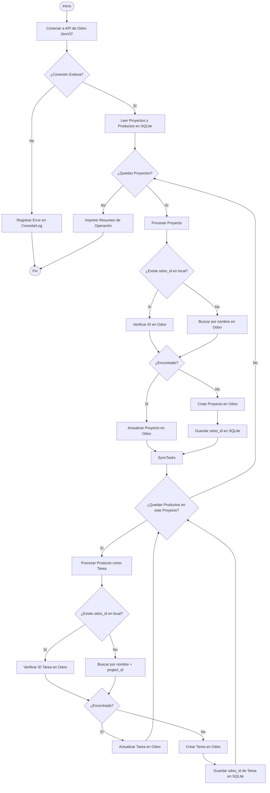

# Bot Scraper de Fabricación + Sincronización con Odoo

Sistema de automatización que extrae datos de proyectos de fabricación, productos y materiales/logística desde un ERP interno web (Playwright, con simulación de navegación humana), los persiste en SQLite con historial completo de cambios de estado, y los sincroniza con **Odoo v19.0** vía su API JSON-RPC 2.0 — todo en una sola ejecución.

Incluye: checkpoints de reanudación ante fallos, reintentos con backoff exponencial que distinguen errores transitorios (red/ERP lento) de permanentes (cambios de estructura del ERP), validación de datos en los modelos, y una suite de tests unitarios (pytest) para las funciones de parseo y los payloads enviados a Odoo.

> Este proyecto es la etapa de extracción del pipeline: alimenta con datos limpios y estructurados un análisis posterior de consumo de materiales por producto.

## MANUAL DE DOCUMENTACIÓN TÉCNICA Y FUNCIONAL
### SISTEMA DE EXTRACCIÓN Y SINCRONIZACIÓN (ERP DE FABRICACIÓN)
> **Fecha de Actualización:** 11 de agosto de 2026
> **Versión:** 2.1
> **Estado del Sistema:** Operativo e Integrado
> **Tecnologías:** Python 3.10, Playwright, SQLite3, Odoo API (JSON-RPC 2.0), pytest

---

## 1. INTRODUCCIÓN Y OBJETIVOS DEL SISTEMA

Este sistema automatiza la extracción de datos desde la plataforma de gestión interna de la empresa (**ERP web propietario**, en adelante "el ERP") y sincroniza la información de fabricación y logística directamente con **Odoo v19.0** a través de su API JSON-2.

El principal objetivo es eliminar la transcripción manual de datos, garantizando una base de datos centralizada y actualizada con el estado real de la fabricación de estructuras (por ejemplo, bandejas solares, brazos de izaje, etc.).

### Desafíos Técnicos Resueltos:
*   **Navegación no agresiva:** El scraper simula el ritmo de un operador humano (pausas aleatorias, tipeo con delay) para no saturar el ERP ni disparar sus límites de tasa.
*   **Concurrencia de Usuarios:** Soporte para inicios de sesión simultáneos de la cuenta compartida por múltiples operarios de diseño.
*   **Resiliencia y Tolerancia a Fallos:** Capacidad de retomar ejecuciones interrumpidas en el último proyecto procesado mediante un sistema de checkpoints.
*   **Estructura Jerárquica:** Migración de una tabla plana a un modelo relacional de 3 niveles (*Proyecto → Producto → Item*).

---

## 2. ARQUITECTURA GENERAL Y FLUJO DE DATOS

El sistema se compone de dos módulos principales que interactúan a través de una base de datos local SQLite:



1.  **Bot Scraper (`scraper-fabricacion/`):** Utiliza Playwright en modo síncrono para navegar, loguearse, extraer la jerarquía de proyectos y materiales, y almacenar todo en SQLite.
2.  **Sincronizador Odoo (`odoo-integration/`):** Lee los datos consolidados en SQLite y realiza operaciones de creación/actualización en Odoo para emparejar la estructura de proyectos y tareas locales con los de la nube.

---

## 3. ESTRUCTURA DE DIRECTORIOS Y ARCHIVOS

El proyecto está organizado en dos módulos principales, más utilidades compartidas, tests y documentación:

```
Proyecto Scraper/
│
├── scraper-fabricacion/                    # MÓDULO DE EXTRACCIÓN WEB
│   ├── main.py                             # Orquestador: control de ventanas horarias, lock, checkpoints, retry/backoff
│   ├── scraper.py                          # Lógica de Playwright (login, extracción y parseo del DOM del ERP)
│   ├── database.py                         # Inicialización de BD SQLite y lógica de upserts/historial
│   ├── models.py                           # Dataclasses con validación (__post_init__) para Proyecto/Producto/Item/Material
│   ├── parsing.py                          # parse_date/parse_float — funciones puras, sin dependencias de config ni Playwright
│   ├── config.py                           # URLs, timeouts y ventanas horarias; carga credenciales desde .env (falla explícito si faltan)
│   ├── extraer_materiales_presupuesto.py   # Herramienta complementaria: materiales por producto con dimensiones (ver §5)
│   ├── requirements.txt                    # Dependencias (Playwright, requests, python-dotenv)
│   ├── run_bot.bat                         # Lanzador automático: scraping + sync con Odoo (respeta ventana horaria)
│   ├── run_bot_manual.bat                  # Igual que el anterior, pero ignora la ventana horaria
│   ├── run_bot_test.bat                    # Modo prueba: solo scraping, limitado a 3 proyectos
│   ├── run_budget_materials.bat            # Lanzador de extraer_materiales_presupuesto.py
│   ├── .env                                # Credenciales del portal del ERP (excluido de git)
│   ├── .env.example                        # Plantilla de .env sin datos reales
│   ├── data/                               # Persistencia local (excluida de git, ver .gitignore)
│   │   ├── fabricacion.db                  # Base de datos SQLite3
│   │   └── materiales_productos.json       # Salida de extraer_materiales_presupuesto.py
│   └── logs/scraper.log                    # Log rotativo (max 5MB, 3 backups)
│
├── odoo-integration/                # MÓDULO DE SINCRONIZACIÓN CON ODOO
│   ├── odoo_sync.py                 # Orquestador de la sincronización (también invocable como módulo)
│   ├── odoo_client.py               # Cliente HTTP para API JSON-2 de Odoo, con retry/backoff en fallos transitorios
│   ├── odoo_models.py               # Dataclasses tipadas (ProyectoLocal/ProductoLocal) para los payloads a Odoo
│   ├── database_reader.py           # Lectura/escritura de la BD SQLite del scraper
│   ├── sync_projects.py             # Sincronización del modelo project.project
│   ├── sync_tasks.py                # Sincronización del modelo project.task (Productos locales)
│   ├── sync_logger.py               # Logging (usa common/logging_utils.py) + tabla SQLite odoo_sync_log
│   ├── run_sync.bat                 # Lanzador de sincronización standalone (sin re-scrapear)
│   ├── requirements.txt             # Dependencias (requests, python-dotenv)
│   ├── .env                         # Credenciales de la API de Odoo (excluido de git)
│   ├── .env.example                 # Plantilla de .env sin datos reales
│   └── logs/odoo_sync.log           # Log rotativo (max 5MB, 3 backups)
│
├── common/                          # Utilidades compartidas entre ambos módulos
│   └── logging_utils.py             # Factory única de logging (RotatingFileHandler + consola UTF-8)
│
├── scripts/manual_exploration/      # Scripts de exploración manual contra el ERP en vivo
│                                     # (NO son un test suite automatizado; no los ejecuta pytest)
│
├── tests/                           # Suite de tests unitarios (pytest) — no tocan el ERP ni Odoo
│   ├── conftest.py                  # Registra ambos módulos en sys.path para los tests
│   ├── test_parsing.py              # parse_date / parse_float (importa parsing.py: no requiere .env)
│   ├── test_models.py               # Validación __post_init__ de los dataclasses del scraper
│   └── test_odoo_builders.py        # ProyectoLocal/ProductoLocal y armado de payloads a Odoo
│
├── docs/historial/                  # Notas de proceso del desarrollo original (checklist, migración de esquema, diagrama de BD)
│
├── .github/workflows/tests.yml      # CI: corre pytest en Python 3.10 y 3.12 (sin .env ni navegador)
├── LICENSE                          # MIT
├── requirements-dev.txt             # Dependencias de desarrollo (pytest)
├── pytest.ini                       # Configuración de pytest (testpaths = tests)
├── .gitignore                       # Excluye credenciales, .env, *.db, logs y datos locales del control de versiones
└── README.md                        # Este archivo
```

---

## 4. MODELO DE DATOS Y ESQUEMA DE BASE DE DATOS

La persistencia local se realiza mediante una base de datos SQLite ubicada en `scraper-fabricacion/data/fabricacion.db`. A continuación, se detalla la estructura lógica de las 11 tablas del sistema:

### Diagrama de Entidad-Relación (ER)



### Detalle de Tablas Principales

#### `proyectos`
*   `nombre` (TEXT, PK): Nombre del proyecto (Ej: `OP_CLIENTE_A_BANDEJA_SOLAR`).
*   `cliente` (TEXT): Nombre del cliente.
*   `estado` (TEXT): Estado global del proyecto en el ERP.
*   `fecha_primera_carga` (DATETIME): Timestamp del primer scraping.
*   `fecha_ultima_sync` (DATETIME): Timestamp de la última vez que fue leído del web.
*   `odoo_id` (INTEGER, NULL): Identificador único de este proyecto en Odoo (`project.project`).

#### `proyecto_productos` (Nivel 2)
*   `id` (INTEGER, PK, AUTOINCREMENT)
*   `proyecto_nombre` (TEXT, FK -> `proyectos.nombre`): Nombre del proyecto padre.
*   `nombre` (TEXT): Nombre del producto de fabricación (Ej: `Bandeja Solar V2`).
*   `cantidad` (REAL): Cantidad de productos requerida.
*   `solicitud` (TEXT/DATE): Fecha de solicitud.
*   `entrega_fc` (TEXT/DATE): Fecha de entrega FC.
*   `entrega` (TEXT/DATE): Fecha de entrega real.
*   `estado` (TEXT): Estado actual del producto (Ej: `En Pintura`, `En Soldadura`).
*   `fecha_primera_carga` (DATETIME)
*   `fecha_ultima_sync` (DATETIME)
*   `odoo_id` (INTEGER, NULL): ID de la tarea asignada en Odoo (`project.task`).
*   *Restricción:* Único `(proyecto_nombre, nombre)`.

#### `producto_items` (Nivel 3)
*   `id` (INTEGER, PK, AUTOINCREMENT)
*   `producto_id` (INTEGER, FK -> `proyecto_productos.id`): ID del producto padre.
*   `nombre` (TEXT): División o partición del producto.
*   `cantidad` (REAL)
*   `solicitud`, `entrega_fc`, `entrega` (TEXT/DATE)
*   `estado` (TEXT)
*   `fecha_primera_carga`, `fecha_ultima_sync` (DATETIME)
*   *Restricción:* Único `(producto_id, nombre)`.

#### `materiales`
*   `id` (INTEGER, PK)
*   `proyecto_nombre` (TEXT, FK -> `proyectos.nombre`)
*   `tipo` (TEXT): `"item"` o `"suministro"`.
*   `codigo_mp` (TEXT): Código de materia prima (Ej: `MP_0414`).
*   `descripcion` (TEXT): Detalle técnico.
*   `proveedor` (TEXT)
*   `cantidad` (REAL)
*   `desperdicio_12`, `validacion_diseno` (REAL) - *Solo aplica a tipo "item"*.
*   `stock_chapa_barras`, `comprar` (REAL)
*   `precio_sw`, `precio_compra` (REAL)
*   `orden_compra` (TEXT)
*   `numero_factura` (TEXT)
*   `estado_compra` (TEXT): Estado logístico (Ej: `En Set IN`, `OC Enviada`).
*   `comentarios` (TEXT)
*   `fecha_primera_carga`, `fecha_ultima_sync` (DATETIME)
*   *Restricción:* Único `(proyecto_nombre, tipo, codigo_mp)`.

#### `proyecto_producto_materiales`
Poblada por la herramienta complementaria `extraer_materiales_presupuesto.py` (ver §5) — a diferencia de `materiales`, discrimina qué material corresponde a cada **producto** puntual y agrega sus dimensiones.
*   `id` (INTEGER, PK)
*   `proyecto_nombre` (TEXT, FK -> `proyectos.nombre`)
*   `producto_nombre` (TEXT)
*   `tipo` (TEXT): `"item"` o `"suministro"`.
*   `nombre` (TEXT): Nombre del material/posición.
*   `codigo_mp`, `descripcion_material` (TEXT)
*   `l_p`, `a`, `c` (REAL): Largo/perímetro, ancho, cantidad.
*   `fecha_ultima_sync` (DATETIME)
*   *Restricción:* Único `(proyecto_nombre, producto_nombre, tipo, nombre, codigo_mp)`.

### Tablas de Historial y Auditoría
Cuando se realiza una nueva extracción de datos, el bot compara el valor actual con el nuevo valor en la BD local. Si el estado cambia, se inserta una fila en las siguientes tablas registrando la transición:

*   `proyectos_historial_estados` (ID, proyecto_nombre, estado_anterior, estado_nuevo, fecha_cambio)
*   `productos_historial_estados` (ID, proyecto_nombre, producto_nombre, estado_anterior, estado_nuevo, fecha_cambio)
*   `items_historial_estados` (ID, producto_id, item_nombre, estado_anterior, estado_nuevo, fecha_cambio)
*   `materiales_historial_estados` (ID, proyecto_nombre, codigo_mp, tipo, estado_anterior, estado_nuevo, fecha_cambio)

---

## 5. BOT SCRAPER DE FABRICACIÓN (STEALTH PLAYWRIGHT)

Este módulo es responsable del ingreso y raspado de datos de la aplicación del ERP.


### Funcionalidades y Mecanismos Críticos:

1.  **Exclusión Mutua (Lock):**  
    El script crea un archivo temporal `scraper.lock` que contiene el identificador de proceso (PID). Si se intenta iniciar el bot mientras hay otra instancia ejecutándose, se valida si el proceso está activo y, en caso positivo, la nueva instancia termina inmediatamente para evitar colisiones.

2.  **Navegación no agresiva:**
    *   **Automation flag:** Se deshabilita la propiedad de Playwright que le indica al navegador web que está siendo controlado por automatización (`navigator.webdriver = false`).
    *   **User-Agent Real:** Se inyecta una cabecera de agente de usuario de un navegador Chrome corriendo en Windows 10 real.
    *   **Simulación de Escritura:** En lugar de rellenar los inputs instantáneamente, el bot hace clic sobre los inputs y escribe el texto carácter por carácter con un retardo aleatorio de entre 50 y 150 ms por tecla.
    *   **Demoras Humanas (Jitter):** Retardos aleatorios configurables de entre 1.5 y 3.5 segundos tras cada acción importante (como un clic en un selector o un cambio de pestaña).
    *   **Restricción Horaria:** Restringe la ejecución automática exclusivamente a dos rangos clave de tráfico habitual en la oficina: **06:11 a 07:22** y **16:00 a 17:00**.

3.  **Gestión de Sesión e Inicio Compartido:**  
    Dado que el usuario `design` es compartido por 4 operarios, la plataforma web puede expulsar la sesión activa del bot. Para manejar esto:
    *   El bot ejecuta `check_session_and_relogin(page)` antes de procesar cada proyecto. Si es expulsado, realiza la re-autenticación de inmediato sin romper el ciclo de procesamiento.

4.  **Tolerancia a Fallos (Checkpoints y Reintentos):**
    *   El procesamiento de cada proyecto tiene un máximo de **3 reintentos**, pero **solo ante errores transitorios** (`PlaywrightTimeoutError`: red lenta, sesión caída, ERP tardando en responder), con **backoff exponencial real** (~5s, ~10s, ~20s entre intentos). Un error que no sea un timeout (p. ej. un selector roto por un cambio de estructura en el ERP) se trata como **permanente**: se loguea de inmediato con traceback completo y no se reintenta, para no desperdiciar minutos reintentando algo que va a fallar siempre igual.
    *   Si los 3 intentos transitorios fallan (o el error fue permanente), se almacena la traza del error en la tabla `proyectos_errores`, se actualiza el checkpoint local y el bot continúa con el siguiente proyecto (de este modo, un solo proyecto dañado no frena todo el lote).
    *   Si más del 20% de los proyectos de una corrida terminan fallidos, se emite una alerta `ERROR` distintiva en el log (`TASA DE FALLO ELEVADA`) para que un patrón estructural (no fallas puntuales) sea visible de inmediato, no enterrado entre cientos de líneas de log.
    *   Un caso especial ya no cuenta como fallo: si la búsqueda de materiales de un proyecto no devuelve ninguna fila, se asume que el proyecto no tiene datos de logística cargados en el ERP (comportamiento verificado en vivo) y se continúa sin reintentar ni marcar el proyecto como fallido.
    *   Tras cada proyecto procesado con éxito, se escribe la fila de checkpoint. Si el proceso se apaga abruptamente (p. ej. por corte eléctrico), al reiniciarse leerá la tabla `checkpoint` y omitirá los proyectos que ya se procesaron.

5.  **Herramienta complementaria — Materiales por Producto (`extraer_materiales_presupuesto.py`):**  
    La extracción principal (`extraer_materiales`) trae los materiales de un **proyecto completo**, sin discriminar a qué producto pertenece cada uno. Este script secundario resuelve esa limitación: navega a la sección de **Presupuesto** del ERP, que sí desglosa los materiales **por producto** — y además trae las **dimensiones de cada pieza** (largo, ancho, cantidad) que la extracción principal no captura.
    *   Requiere que el scraper principal ya haya corrido al menos una vez (cruza los productos vía la tabla `proyecto_productos` de la BD local).
    *   Guarda los resultados en la tabla `proyecto_producto_materiales` de SQLite y también en `data/materiales_productos.json` (útil para consumir desde un notebook de análisis sin tocar la BD).
    *   Se ejecuta de forma independiente y manual (no forma parte de `run_bot.bat`): `run_budget_materials.bat`, o `python extraer_materiales_presupuesto.py`.

---

## 6. SINCRONIZADOR CON ODOO (JSON-RPC 2.0)

Este módulo lee los datos guardados en SQLite por el bot y los sincroniza con la API nativa de Odoo v19.0.

### Flujo de Ejecución del Sincronizador



### Componentes y Protocolos del Sincronizador:

1.  **API JSON-2 Client (`odoo_client.py`):**  
    Odoo v19 utiliza un endpoint REST con formato JSON-RPC 2.0. Las peticiones se dirigen a `POST /json/2/<modelo>/<metodo>`.
    *   **Cabeceras:** Requiere cabecera de autenticación `Authorization: bearer <API_KEY>` y cabecera de base de datos `X-Odoo-Database: <BD_NAME>`.
    *   **Mapeos Implementados:**
        *   `search`: Retorna los IDs coincidentes con un dominio.
        *   `search_read`: Retorna los campos solicitados de las entidades.
        *   `create`: Registra datos enviando una lista de diccionarios.
        *   `write`: Modifica registros pasando sus IDs de Odoo y el payload correspondiente.

2.  **Sincronización de Proyectos (`sync_projects.py`):**
    *   Mapea proyectos de SQLite al modelo `project.project` de Odoo.
    *   El campo `name` se asocia con el nombre de proyecto local. El campo `description` en Odoo se compone combinando la información de `cliente` y `estado` actuales (Ej: `Cliente: CLIENTE_A | Estado: Material OK`).
    *   El sistema escribe el ID asignado por Odoo de vuelta en la columna `odoo_id` de la tabla `proyectos` local.

3.  **Sincronización de Tareas (`sync_tasks.py`):**
    *   Mapea los **Productos** locales (Nivel 2 de la base de datos) como Tareas (`project.task`) dentro del proyecto Odoo correspondiente.
    *   *Nota de Diseño:* Los **Items** (Nivel 3) se ignoran intencionalmente en la sincronización de Odoo para evitar saturación de registros.
    *   La descripción de la tarea en Odoo recopila el estado del producto, la cantidad y las fechas de solicitud/entrega FC.
    *   La **fecha de entrega** real se mapea al campo `date_deadline` (fecha de vencimiento de la tarea) en Odoo.
    *   El sistema escribe el ID asignado por Odoo de vuelta en la columna `odoo_id` de la tabla `proyecto_productos` local.

4.  **Logging Dual de Sincronización (`sync_logger.py`):**
    *   Genera logs legibles en `odoo-integration/logs/odoo_sync.log`.
    *   Persiste de manera estructurada en SQLite dentro de la tabla `odoo_sync_log` las acciones realizadas (`created`, `updated`, `skipped`, `error`) junto con el modelo, ID Odoo y descripción detallada del cambio para auditoría rápida en software de visualización de base de datos.

---

## 7. MIGRACIONES Y CAMBIOS IMPLEMENTADOS RECIENTES

Durante el ciclo de desarrollo actual se ejecutaron las siguientes mejoras mayores:

1.  **Migración de 2 a 3 Niveles en el Scraper y BD:**
    *   *Anteriormente:* La estructura se componía únicamente por *Proyecto* y una tabla plana de *Subitems*.
    *   *Ahora:* Se normalizó la base de datos dividiendo subitems en dos entidades relacionales: `proyecto_productos` (Nivel 2) y `producto_items` (Nivel 3).
    *   El scraper analiza los atributos de árbol HTML (`data-tt-id` y `data-tt-parent-id`) para trazar la estructura exacta del árbol en la página de proyectos.
2.  **Creación de Tablas de Historial de Estados:**  
    Se separó el historial plano en `productos_historial_estados` e `items_historial_estados` para evitar mezclar datos.
3.  **Sincronización de Productos en Odoo:**  
    Se adaptó el sincronizador para crear tareas sólo a nivel de Producto (`proyecto_productos`), omitiendo la creación de miles de ítems secundarios repetitivos en Odoo.
4.  **Limpieza Automatizada de Tareas Antiguas:**  
    Se diseñó y ejecutó un script de limpieza para vaciar las tareas huérfanas en Odoo de forma masiva en lotes de a 100 registros para evitar sobrecargar la pasarela API del servidor.

5.  **Revisión de código (11 de agosto de 2026) — hallazgos y correcciones aplicadas:**  
    Se realizó una revisión completa del scraper y el sincronizador siguiendo el checklist estándar (reintentos, autenticación, selectores, validación de datos, logging). Se analizaron ~5800 líneas de `scraper-fabricacion/logs/scraper.log` acumuladas desde mayo, lo que permitió identificar y corregir la causa raíz de por qué algunos proyectos quedaban sin datos de materiales. Cambios aplicados:
    *   **Causa raíz de "faltan materiales" encontrada y corregida:** un grupo fijo de proyectos (`OP_CLIENTE_B_BANQUINAS`, `OP_CLIENTE_A_Complemento`, `OP_CLIENTE_C_reacondicionado`, entre otros) fallaba en *cada* corrida desde hacía meses porque la búsqueda de materiales para esos proyectos no devolvía ninguna fila. Se verificó en vivo contra el ERP que esto ocurre incluso sin filtro de estado — el proyecto simplemente no tiene datos de logística cargados. Antes, esto se trataba como timeout genérico: 3 reintentos inútiles (~60-90s desperdiciados por proyecto en cada corrida) y el proyecto se marcaba como "fallido". Ahora `extraer_materiales()` (`scraper.py`) detecta el caso de "sin filas" y lo registra como advertencia informativa, sin reintentar ni marcar el proyecto como incidente.
    *   **Unificación scraper + sync de Odoo:** `main.py` ya no invoca `odoo_sync.py` como subproceso separado (`subprocess.run`); ahora importa `run_sync()` directamente (agregando `odoo-integration/` al `sys.path`). Una sola ejecución con `--sync` hace scraping y sincronización con Odoo en un solo proceso.
    *   **Reintentos transitorios vs. permanentes (`main.py`):** el loop de reintento por proyecto ahora distingue `PlaywrightTimeoutError` (transitorio: red/sesión/ERP lento — se reintenta con backoff exponencial ~5/10/20s) de cualquier otro error (permanente: típicamente un selector roto — se loguea con traceback completo y no se reintenta). Se agregó una alerta `ERROR` si más del 20% de los proyectos de una corrida fallan, para detectar problemas estructurales del ERP rápidamente.
    *   **Reintentos en el cliente de Odoo (`odoo_client.py`):** `_call()` ahora reintenta con backoff exponencial ante errores de red y HTTP 5xx (hasta 3 intentos); los HTTP 4xx (errores permanentes de auth/validación) no se reintentan.
    *   **Validación de datos (`scraper.py`):** `parse_date()` ya no devuelve el string crudo sin parsear cuando no reconoce el formato — ahora loguea una advertencia y devuelve `None`, para que un valor no parseable nunca quede disfrazado de fecha ISO válida en la BD. `parse_float()` loguea una advertencia cuando no puede convertir un valor (antes fallaba en silencio).
    *   **Guarda defensiva de columnas (`scraper.py`):** `extraer_proyectos()` ahora valida la cantidad de columnas (`<td>`) antes de indexarlas posicionalmente, y loguea un mensaje específico si el ERP cambia la estructura, en vez de un `IndexError` genérico difícil de diagnosticar.
    *   **Scripts de `test/` reubicados a `scripts/manual_exploration/`:** estos scripts golpean el ERP de producción con credenciales reales y no son un test suite automatizado; tenían rutas absolutas hardcodeadas a otra máquina que no resolvían en este equipo. Se corrigieron las rutas (ahora relativas al propio script) y se les agregó una advertencia explícita en el docstring. `test_db_history.py` (que modifica proyectos reales para probar el historial) ahora requiere el flag `--confirmar` antes de tocar cualquier dato, y ya no usa `os.system()` sino `subprocess.run()`.
    *   **Higiene del repositorio:** se agregó `.gitignore` (excluye `credenciales.txt`, `.env`, `*.db`, logs), se eliminó una copia duplicada y obsoleta de `fabricacion.db` fuera de `data/`, y se agregaron plantillas de configuración de ejemplo para ambos módulos (hoy `scraper-fabricacion/.env.example` y `odoo-integration/.env.example`).
6.  **Segunda pasada (11 de agosto de 2026) — credenciales, logging compartido y validación de datos:**
    *   **Credenciales de respaldo eliminadas (`config.py`):** ya no existe el fallback de usuario/contraseña hardcodeado. Si el archivo de credenciales falta o está incompleto, `config.py` lanza `ConfigError` explícito al arrancar en vez de autenticar en silencio con una cuenta real embebida en el código fuente.
    *   **Corrección de diagnóstico (con evidencia del usuario):** `OP-ING-XXXXX-000000-0001` **sí tiene materiales cargados** en el ERP (confirmado por captura de pantalla) — la hipótesis anterior de "proyecto sin datos" no aplicaba a este caso. Investigado en vivo, la causa real es doble: (1) la petición AJAX que carga el panel de detalle al hacer clic en "Visualizar Detalle" falla de forma intermitente en el servidor del ERP (a veces HTTP 500, a veces el clic no dispara ninguna petición); y (2) cuando eso pasa, el propio JS del ERP deja su modal de "cargando" (`.jquery-loading-modal`) atascado en pantalla, bloqueando los clics de reintento siguientes. Se corrigió el punto (2) en `extraer_materiales()`: antes de reintentar el clic, se limpia el overlay atascado vía `page.evaluate()`. Verificado en vivo que el clic de reintento ya no se cuelga. El punto (1) es una falla intermitente del lado del ERP fuera del control del scraper; queda mitigada por el reintento local (2 intentos) más el reintento completo de `main.py` (3 intentos con backoff).
    *   **Logging unificado (`common/logging_utils.py`, nuevo):** `scraper.py` y `odoo-integration/sync_logger.py` ya no definen cada uno su propio setup de `RotatingFileHandler`/`StreamHandler` — ambos llaman a una única función `setup_rotating_logger()` compartida, con manejo de encoding UTF-8 en consola para evitar mojibake con los emoji de los logs en Windows.
    *   **Selectores de materiales centralizados:** los ~12 selectores de campo de `extraer_materiales_de_seccion()` (antes armados inline con f-strings sueltas, ej. `f"#{pfx}cant_{mid}"`) ahora se arman desde una tabla única `MATERIAL_ID_PATTERNS` en `scraper.py`. Un cambio futuro del ERP en el nombre de un campo es una línea en la tabla.
    *   **Validación en los modelos (`models.py`):** los 4 dataclasses (`Proyecto`, `Producto`, `ProductoItem`, `Material`) ahora tienen `__post_init__` que valida nombres vacíos, tipos de campos numéricos y que `Material.tipo` sea un valor conocido — cualquier desvío se loguea con contexto en vez de fallar en silencio o recién explotar como `KeyError` río abajo.

7.  **Tercera pasada (11 de agosto de 2026) — typed builders del lado Odoo, suite de tests y limpieza final del repositorio:**
    *   **Typed builders en `odoo-integration/`:** nuevo `odoo_models.py` con dataclasses `ProyectoLocal`/`ProductoLocal`, reemplazando los `dict` sueltos que usaban `sync_projects.py`/`sync_tasks.py`/`odoo_sync.py`. Un typo en un nombre de campo ahora se detecta al construir el objeto, no recién en producción como `KeyError`. Verificado con `--dry-run` real (75 proyectos, 0 errores) antes y después del cambio.
        *   *Bug encontrado y corregido en el proceso:* nombrar este archivo `models.py` (igual que `scraper-fabricacion/models.py`) rompía el import de `main.py`, porque ambas carpetas quedan en `sys.path` a la vez (por la unificación del punto 6) y Python cachea el primer módulo `models` que se importa. Se renombró a `odoo_models.py` y se revalidó la corrida completa.
    *   **Suite de tests (`tests/`, nuevo, con pytest):** 38 tests cubriendo `parse_date`/`parse_float`, la validación `__post_init__` de los dataclasses, y el armado de los payloads que se mandan a Odoo. Corren en <1 segundo, sin tocar el ERP ni Odoo.
    *   **Limpieza y reestructuración del repositorio** (para publicación en GitHub): se eliminaron los HTML de referencia del ERP, capturas de pantalla de exploración (`scratch/`), un script de conexión suelto sin relación con el proyecto, y un archivo de plan inicial con lenguaje sensible sobre evasión de detección (contenido ya cubierto de forma neutral en §5). Las notas de proceso del desarrollo original (`task.md`, `walkthrough.md`, diagrama de BD) se consolidaron en `docs/historial/`. Este archivo se promovió de `DOCUMENTACION.md` a `README.md` para que GitHub lo muestre como portada del repositorio.

8.  **Credenciales del scraper migradas a `.env` (`config.py`):** el archivo `credenciales.txt` (formato de texto plano casero, parseado línea por línea) se reemplazó por `scraper-fabricacion/.env` (`SET_IN_URL`, `SET_IN_USERNAME`, `SET_IN_PASSWORD`), cargado con `python-dotenv` — el mismo mecanismo que ya usaba `odoo-integration/`, así ambos módulos manejan secretos de la misma forma en vez de tener dos convenciones distintas. La migración se hizo con un script que leyó el archivo viejo y escribió el `.env` directamente, sin que los valores reales pasaran por ningún log ni salida visible. Se mantiene el mismo comportamiento de fallo explícito (`ConfigError`) si faltan datos.

---

## 8. GUÍA DE OPERACIÓN Y MANTENIMIENTO

### Requisitos Previos e Instalación

Para configurar la máquina local o servidor que ejecute los bots:

1.  Asegurar instalación de Python 3.10+. En Windows, los lanzadores `.bat` usan `py -3.10` si el launcher lo tiene disponible, y si no caen automáticamente al `python` del PATH (o del entorno virtual activo).
2.  Instalar dependencias:
    *   Para el Scraper (incluye lo necesario para invocar la sincronización con Odoo en el mismo proceso): `pip install -r scraper-fabricacion/requirements.txt`
    *   Para correr el sincronizador de Odoo de forma standalone: `pip install -r odoo-integration/requirements.txt`
    *   Para correr los tests: `pip install -r requirements-dev.txt`
3.  Inicializar Playwright en la terminal (solo la primera vez):
    ```powershell
    playwright install chromium
    ```
4.  Copiar `scraper-fabricacion/.env.example` → `scraper-fabricacion/.env` y `odoo-integration/.env.example` → `odoo-integration/.env`, completando con los datos reales (ninguno de los dos se sube a git).

### Ejecución Manual

En `scraper-fabricacion/`, se pueden usar los siguientes scripts Batch (.bat) preconfigurados:

*   **`run_bot.bat` (Modo Automático):** Scraping + sincronización con Odoo en un solo proceso (`main.py --sync`). Solo funcionará dentro de las ventanas horarias permitidas (`06:11-07:22` y `16:00-17:00`).
*   **`run_bot_manual.bat` (Modo Forzado/Manual):** Igual que el anterior (`main.py --force --sync`), pero ignora la restricción de horario.
*   **`run_bot_test.bat` (Modo Prueba):** Lanza `main.py --force --test`. Solo scraping, limitado a los primeros 3 proyectos — útil para verificar selectores del ERP rápidamente sin tocar Odoo.
*   **`run_budget_materials.bat`:** Corre `extraer_materiales_presupuesto.py` (ver §5) — requiere que el scraper principal ya haya corrido al menos una vez.

En `odoo-integration/`, para sincronizar sin re-scrapear:
*   **`run_sync.bat`** (o `python odoo_sync.py`), soporta argumentos:
    ```powershell
    python odoo_sync.py                   # Sincronización normal
    python odoo_sync.py --dry-run         # Simulación, no escribe en Odoo
    python odoo_sync.py --only-projects   # Solo proyectos, sin tareas/productos
    ```

### Tests

Desde la raíz del proyecto:
```powershell
pip install -r requirements-dev.txt
pytest
```
La suite (`tests/`) corre en menos de un segundo y no hace ninguna llamada al ERP ni a Odoo — valida las funciones puras de parseo (`parse_date`, `parse_float`), la validación de los dataclasses, y el armado de los payloads que se envían a Odoo.

**No requiere `.env` ni navegador instalado:** corre tal cual en un clon recién hecho y en CI. Las funciones de parseo viven en `scraper-fabricacion/parsing.py`, que solo depende de la stdlib, justamente para que importarlas no arrastre `config.py` (que lee el `.env` en tiempo de import y aborta la colección de pytest si falta).

### Configuración del Programador de Tareas de Windows

Para programar la ejecución en segundo plano sin intervención humana:

1.  Abrir el **Programador de Tareas de Windows** y seleccionar **Crear Tarea Básica**.
2.  **Desencadenador:** Programar diariamente en los rangos autorizados (ej: 06:15 y 16:15).
3.  **Acción:** Iniciar un programa.
4.  **Programa o script:** Buscar y seleccionar el archivo `run_bot.bat`.
5.  **Iniciar en:** Colocar la ruta absoluta a la carpeta `scraper-fabricacion/` en la máquina donde corra la tarea.

### Monitoreo e Interpretación de Logs

Cuando ocurran incidentes, verificar las siguientes fuentes en orden:

1.  **`scraper-fabricacion/logs/scraper.log`:** Contiene las trazas detalladas de navegación, fallas de login o caída de selectores del portal del ERP.
2.  **`odoo-integration/logs/odoo_sync.log`:** Contiene las respuestas HTTP y el estado de la comunicación por API con el servidor de Odoo.
3.  **Consulta SQL sobre `fabricacion.db`:**
    *   Para ver ejecuciones fallidas del scraper:
        ```sql
        SELECT * FROM ejecuciones WHERE estado != 'ok';
        SELECT * FROM proyectos_errores;
        ```
    *   Para ver el historial logueado de Odoo:
        ```sql
        SELECT * FROM odoo_sync_log WHERE accion = 'error';
        ```

---

## 9. LICENCIA

Publicado bajo licencia MIT — ver [LICENSE](LICENSE).

Los nombres de la empresa, de los clientes y el host del ERP fueron
anonimizados en esta documentación (`CLIENTE_A`, `CLIENTE_B`, …). Las
credenciales se leen exclusivamente de archivos `.env` locales, excluidos del
control de versiones; no hay ninguna en el código ni en el historial del repo.
