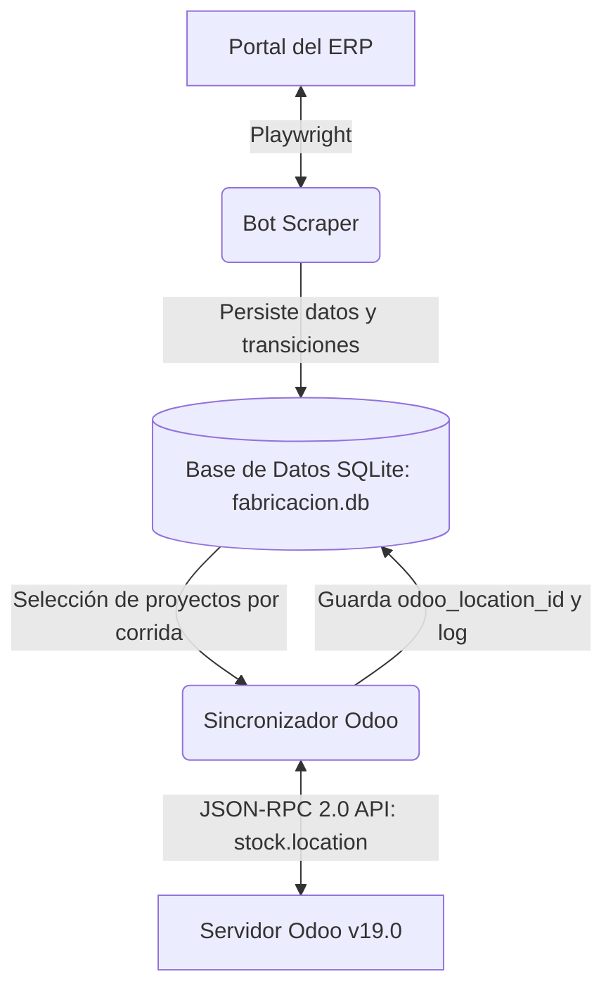
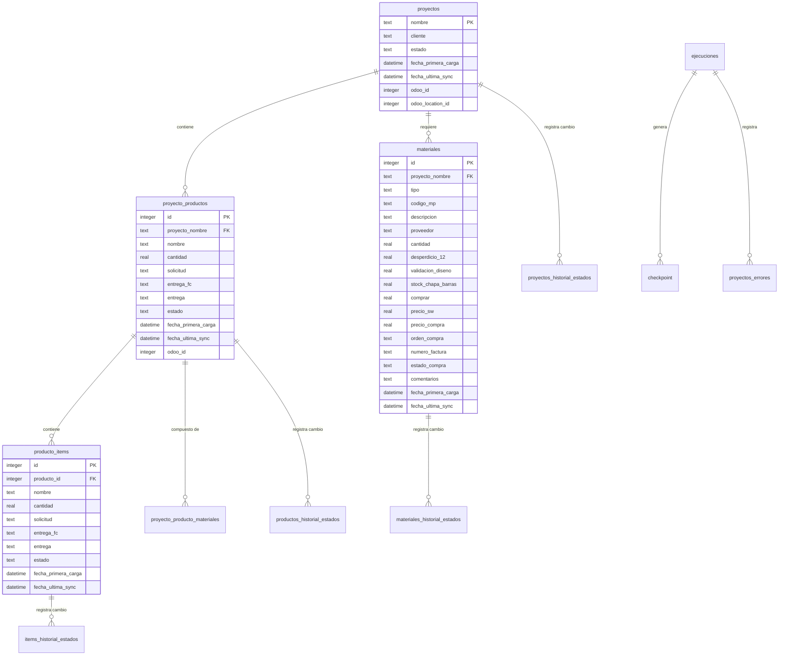
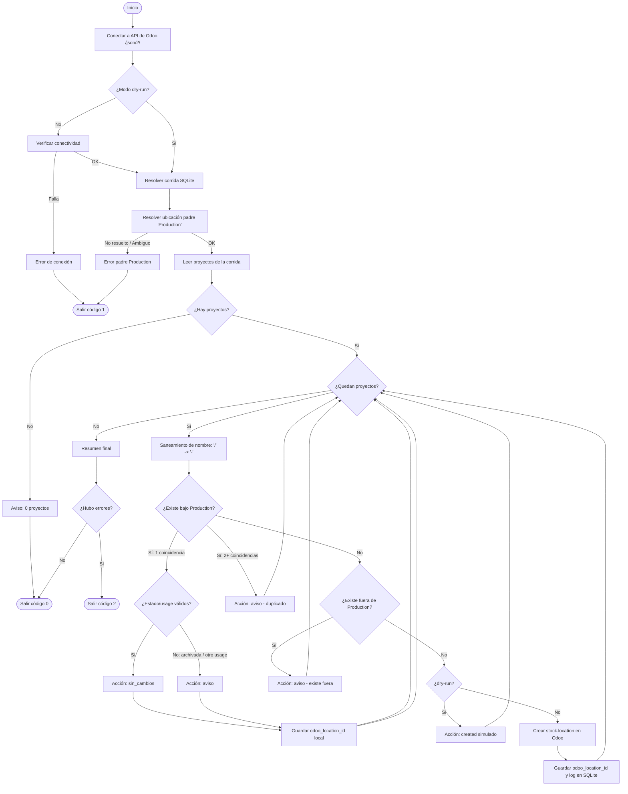

# Bot Scraper de Fabricación + Sincronización con Odoo

Sistema de automatización que extrae datos de proyectos de fabricación, productos y materiales/logística desde un ERP interno web (Playwright, con simulación de navegación humana), los persiste en SQLite con historial completo de cambios de estado, y los sincroniza con **Odoo v19.0** vía su API JSON-RPC 2.0 — todo en una sola ejecución.

Incluye: checkpoints de reanudación ante fallos, reintentos con backoff exponencial que distinguen errores transitorios (red/ERP lento) de permanentes (cambios de estructura del ERP), validación de datos en los modelos, y una suite de tests unitarios (pytest) para las funciones de parseo, selección de proyectos por corrida y payloads enviados a Odoo.

> Este proyecto es la etapa de extracción del pipeline: alimenta con datos limpios y estructurados un análisis posterior de consumo de materiales por producto.

## MANUAL DE DOCUMENTACIÓN TÉCNICA Y FUNCIONAL
### SISTEMA DE EXTRACCIÓN Y SINCRONIZACIÓN (ERP DE FABRICACIÓN)
> **Fecha de Actualización:** 18 de agosto de 2026
> **Versión:** 3.0
> **Estado del Sistema:** Operativo e Integrado
> **Tecnologías:** Python 3.10–3.13, Playwright, SQLite3, Odoo API (JSON-RPC 2.0), pytest

---

## 1. INTRODUCCIÓN Y OBJETIVOS DEL SISTEMA

Este sistema automatiza la extracción de datos desde la plataforma de gestión interna de la empresa (**ERP web propietario**, en adelante "el ERP") y sincroniza la información de fabricación y logística directamente con **Odoo v19.0** a través de su API JSON-2.

### Por qué existe este bot

El ERP no ofrece una API ni acceso directo a su base de datos: la única vía que el desarrollador del sistema podía dar para una consulta masiva de datos era armar a mano un CSV con toda la información de proyectos y materiales, bajo pedido. En el día a día, esto se traducía en exportar manualmente planillas XLSX de proyectos y listas de materiales cada vez que alguien las necesitaba — un trabajo repetitivo, que quedaba desactualizado en cuanto el ERP cambiaba de estado, y que dejaba los datos en manos de quien hizo la exportación puntual en vez de disponibles para el resto del equipo.

El principal objetivo de este sistema es eliminar esa carga: automatizar la extracción para que los datos queden centralizados y actualizados en una base de datos relacional (`fabricacion.db`), disponibles para cualquiera que los necesite sin depender de una descarga manual, y en un formato que habilita el análisis posterior de consumo de materiales por producto — algo que las planillas sueltas no permitían hacer de forma sistemática.

### Desafíos Técnicos Resueltos:
*   **Navegación no agresiva:** El scraper simula el ritmo de un operador humano (pausas aleatorias, tipeo con delay) para no saturar el ERP ni disparar sus límites de tasa.
*   **Concurrencia de Usuarios:** Soporte para inicios de sesión simultáneos de la cuenta compartida por múltiples operarios de diseño.
*   **Resiliencia y Tolerancia a Fallos:** Capacidad de retomar ejecuciones interrumpidas en el último proyecto procesado mediante un sistema de checkpoints.
*   **Estructura Jerárquica:** Migración de una tabla plana a un modelo relacional de 3 niveles (*Proyecto → Producto → Item*).
*   **Sincronización por corrida con Odoo:** Creación de ubicaciones virtuales de producción (`stock.location`) para los proyectos procesados en la corrida activa.

---

## 2. ARQUITECTURA GENERAL Y FLUJO DE DATOS

El sistema se compone de dos módulos principales que interactúan a través de una base de datos local SQLite:



1.  **Bot Scraper (`scraper-fabricacion/`):** Utiliza Playwright en modo síncrono para navegar, loguearse, extraer la jerarquía de proyectos y materiales, y almacenar todo en SQLite.
2.  **Sincronizador Odoo (`odoo-integration/`):** Lee los proyectos procesados en la última corrida del bot desde SQLite y crea ubicaciones virtuales de producción (`stock.location` con `usage='production'`) bajo la ubicación padre `Production` en Odoo v19.0.

---

## 3. ESTRUCTURA DE DIRECTORIOS Y ARCHIVOS

El proyecto está organizado en dos módulos principales, más utilidades compartidas, tests y documentación:

```
Proyecto Scraper/
│
├── scraper-fabricacion/                    # MÓDULO DE EXTRACCIÓN WEB
│   ├── main.py                             # Orquestador: control de ventanas horarias, lock, checkpoints, retry/backoff
│   ├── scraper.py                          # Lógica de Playwright (login, extracción y parseo del DOM del ERP)
│   ├── database.py                         # Inicialización de BD SQLite y lógica de upserts/historial
│   ├── models.py                           # Dataclasses con validación (__post_init__) para Proyecto/Producto/Item/Material
│   ├── parsing.py                          # parse_date/parse_float — funciones puras, sin dependencias de config ni Playwright
│   ├── config.py                           # URLs, timeouts y ventanas horarias; carga credenciales desde .env (falla explícito si faltan)
│   ├── extraer_materiales_presupuesto.py   # Herramienta complementaria: materiales por producto con dimensiones (ver §5)
│   ├── requirements.txt                    # Dependencias (Playwright, requests, python-dotenv)
│   ├── run_bot.bat                         # Lanzador automático: scraping + sync con Odoo (respeta ventana horaria)
│   ├── run_bot_manual.bat                  # Igual que el anterior, pero ignora la ventana horaria
│   ├── run_bot_test.bat                    # Modo prueba: solo scraping, limitado a 3 proyectos
│   ├── run_budget_materials.bat            # Lanzador de extraer_materiales_presupuesto.py
│   ├── .env                                # Credenciales del portal del ERP (excluido de git)
│   ├── .env.example                        # Plantilla de .env sin datos reales
│   ├── data/                               # Persistencia local (excluida de git, ver .gitignore)
│   │   ├── fabricacion.db                  # Base de datos SQLite3
│   │   └── materiales_productos.json       # Salida de extraer_materiales_presupuesto.py
│   └── logs/scraper.log                    # Log rotativo (max 5MB, 3 backups)
│
├── odoo-integration/                       # MÓDULO DE SINCRONIZACIÓN CON ODOO
│   ├── odoo_sync.py                        # Orquestador de la sincronización (también invocable como módulo)
│   ├── odoo_client.py                      # Cliente HTTP para API JSON-2 de Odoo, con retry/backoff en fallos transitorios
│   ├── odoo_models.py                      # Dataclass tipada (ProyectoLocal) para los datos a Odoo
│   ├── database_reader.py                  # Lectura/escritura de la BD SQLite del scraper filtrada por corrida
│   ├── sync_locations.py                   # Creación y verificación de stock.location bajo Production
│   ├── sync_logger.py                      # Logging (usa common/logging_utils.py) + tabla SQLite odoo_sync_log
│   ├── run_sync.bat                        # Lanzador de sincronización standalone (sin re-scrapear)
│   ├── requirements.txt                    # Dependencias (requests, python-dotenv)
│   ├── .env                                # Credenciales de la API de Odoo (excluido de git)
│   ├── .env.example                        # Plantilla de .env sin datos reales
│   └── logs/odoo_sync.log                  # Log rotativo (max 5MB, 3 backups)
│
├── common/                                 # Utilidades compartidas entre ambos módulos
│   └── logging_utils.py                    # Factory única de logging (RotatingFileHandler + consola UTF-8)
│
├── scripts/manual_exploration/             # Scripts de exploración manual contra el ERP u Odoo en vivo
│   ├── explorar_ubicaciones_odoo.py        # Exploración en solo lectura de stock.location en Odoo en vivo
│   └── test_login.py                       # Verificación manual de login en el ERP
│
├── tests/                                  # Suite de tests unitarios (pytest) — no tocan el ERP ni Odoo
│   ├── conftest.py                         # Registra ambos módulos en sys.path para los tests
│   ├── test_parsing.py                     # parse_date / parse_float (importa parsing.py: no requiere .env)
│   ├── test_models.py                      # Validación __post_init__ de los dataclasses del scraper
│   ├── test_odoo_locations.py              # Saneo de nombres, armado de payloads y lógica de sync_locations
│   └── test_run_selection.py               # Selección de proyectos por corrida en database_reader
│
├── docs/                                   # Planes de ejecución y reportes técnicos
│   ├── plan_stock_locations.md             # Plan de ejecución detallado de ubicaciones de producción
│   ├── fase1_recon_ubicaciones.md          # Reporte crudo de reconocimiento en Odoo
│   ├── reporte_antigravity_01.md           # Reporte de cierre de iteración
│   └── historial/                          # Notas de proceso del desarrollo original
│
├── .github/workflows/tests.yml             # CI: corre pytest en Python 3.10, 3.12 y 3.13 (sin .env ni red)
├── LICENSE                                 # MIT
├── requirements-dev.txt                    # Dependencias de desarrollo (pytest, requests, python-dotenv)
├── pytest.ini                              # Configuración de pytest (testpaths = tests)
├── .gitignore                              # Excluye credenciales, *.db, logs y datos locales
├── .gitattributes                          # Normaliza finales de línea entre distintos SO
└── README.md                               # Este archivo
```

---

## 4. MODELO DE DATOS Y ESQUEMA DE BASE DE DATOS

La persistencia local se realiza mediante una base de datos SQLite ubicada en `scraper-fabricacion/data/fabricacion.db`. A continuación, se detalla la estructura lógica de las tablas del sistema:

### Diagrama de Entidad-Relación (ER)



### Detalle de Tablas Principales

#### `proyectos`
*   `nombre` (TEXT, PK): Nombre del proyecto (Ej: `OP_CLIENTE_A_BANDEJA_SOLAR`).
*   `cliente` (TEXT): Nombre del cliente.
*   `estado` (TEXT): Estado global del proyecto en el ERP.
*   `fecha_primera_carga` (DATETIME): Timestamp del primer scraping.
*   `fecha_ultima_sync` (DATETIME): Timestamp de la última vez que fue leído del web.
*   `odoo_id` (INTEGER, NULL): Identificador histórico en Odoo (`project.project`).
*   `odoo_location_id` (INTEGER, NULL): Identificador único de la ubicación de producción de este proyecto en Odoo (`stock.location`).

#### `proyecto_productos` (Nivel 2)
*   `id` (INTEGER, PK, AUTOINCREMENT)
*   `proyecto_nombre` (TEXT, FK -> `proyectos.nombre`): Nombre del proyecto padre.
*   `nombre` (TEXT): Nombre del producto de fabricación (Ej: `Bandeja Solar V2`).
*   `cantidad` (REAL): Cantidad de productos requerida.
*   `solicitud` (TEXT/DATE): Fecha de solicitud.
*   `entrega_fc` (TEXT/DATE): Fecha de entrega FC.
*   `entrega` (TEXT/DATE): Fecha de entrega real.
*   `estado` (TEXT): Estado actual del producto (Ej: `En Pintura`, `En Soldadura`).
*   `fecha_primera_carga` (DATETIME)
*   `fecha_ultima_sync` (DATETIME)
*   `odoo_id` (INTEGER, NULL): ID histórico de la tarea asignada en Odoo (`project.task`).
*   *Restricción:* Único `(proyecto_nombre, nombre)`.

#### `producto_items` (Nivel 3)
*   `id` (INTEGER, PK, AUTOINCREMENT)
*   `producto_id` (INTEGER, FK -> `proyecto_productos.id`): ID del producto padre.
*   `nombre` (TEXT): División o partición del producto.
*   `cantidad` (REAL)
*   `solicitud`, `entrega_fc`, `entrega` (TEXT/DATE)
*   `estado` (TEXT)
*   `fecha_primera_carga`, `fecha_ultima_sync` (DATETIME)
*   *Restricción:* Único `(producto_id, nombre)`.

#### `materiales`
*   `id` (INTEGER, PK)
*   `proyecto_nombre` (TEXT, FK -> `proyectos.nombre`)
*   `tipo` (TEXT): `"item"` o `"suministro"`.
*   `codigo_mp` (TEXT): Código de materia prima (Ej: `MP_0414`).
*   `descripcion` (TEXT): Detalle técnico.
*   `proveedor` (TEXT)
*   `cantidad` (REAL)
*   `desperdicio_12`, `validacion_diseno` (REAL) - *Solo aplica a tipo "item"*.
*   `stock_chapa_barras`, `comprar` (REAL)
*   `precio_sw`, `precio_compra` (REAL)
*   `orden_compra` (TEXT)
*   `numero_factura` (TEXT)
*   `estado_compra` (TEXT): Estado logístico (Ej: `En Set IN`, `OC Enviada`).
*   `comentarios` (TEXT)
*   `fecha_primera_carga`, `fecha_ultima_sync` (DATETIME)
*   *Restricción:* Único `(proyecto_nombre, tipo, codigo_mp)`.

#### `proyecto_producto_materiales`
Poblada por la herramienta complementaria `extraer_materiales_presupuesto.py` (ver §5) — a diferencia de `materiales`, discrimina qué material corresponde a cada **producto** puntual y agrega sus dimensiones.
*   `id` (INTEGER, PK)
*   `proyecto_nombre` (TEXT, FK -> `proyectos.nombre`)
*   `producto_nombre` (TEXT)
*   `tipo` (TEXT): `"item"` o `"suministro"`.
*   `nombre` (TEXT): Nombre del material/posición.
*   `codigo_mp`, `descripcion_material` (TEXT)
*   `l_p`, `a`, `c` (REAL): Largo/perímetro, ancho, cantidad.
*   `fecha_ultima_sync` (DATETIME)
*   *Restricción:* Único `(proyecto_nombre, producto_nombre, tipo, nombre, codigo_mp)`.

### Tablas de Historial y Auditoría
Cuando se realiza una nueva extracción de datos, el bot compara el valor actual con el nuevo valor en la BD local. Si el estado cambia, se inserta una fila en las siguientes tablas registrando la transición:

*   `proyectos_historial_estados` (ID, proyecto_nombre, estado_anterior, estado_nuevo, fecha_cambio)
*   `productos_historial_estados` (ID, proyecto_nombre, producto_nombre, estado_anterior, estado_nuevo, fecha_cambio)
*   `items_historial_estados` (ID, producto_id, item_nombre, estado_anterior, estado_nuevo, fecha_cambio)
*   `materiales_historial_estados` (ID, proyecto_nombre, codigo_mp, tipo, estado_anterior, estado_nuevo, fecha_cambio)

---

## 5. BOT SCRAPER DE FABRICACIÓN (NAVEGACIÓN AUTOMATIZADA CON PLAYWRIGHT)

Este módulo es responsable del ingreso y raspado de datos de la aplicación del ERP.

```mermaid
flowchart TD
    Start([Inicio]) --> Lock[Intentar Adquirir Lock de Ejecución]
    Lock --> CheckTime{¿Ejecución Automática y fuera de Ventana Horaria?}
    CheckTime -- Sí --> Exit[Cerrar Ejecución]
    CheckTime -- No --> InitDB[Inicializar Base de Datos SQLite]
    InitDB --> Checkpoint{¿Hay Checkpoint Activo?}
    Checkpoint -- Sí --> Resume[Leer último proyecto OK y saltar procesados]
    Checkpoint -- No --> StartNew[Procesar lista completa]
    
    Resume & StartNew --> PW[Lanzar Playwright Chromium]
    PW --> Login[Autenticación con Reintentos]
    Login --> ExtraerProj[Extraer Jerarquía de Proyectos del árbol HTML]
    
    ExtraerProj --> LoopProj{¿Quedan proyectos en cola?}
    LoopProj -- No --> Finish[Limpiar Checkpoint, Cerrar Browser, Liberar Lock]
    Finish --> SyncCheck{¿Flag --sync activo?}
    SyncCheck -- Sí --> RunSync[Import directo: odoo_sync.run_sync&#40;&#41;]
    SyncCheck -- No --> End([Fin])
    RunSync --> End
    
    LoopProj -- Sí --> Proj[Procesar Proyecto]
    Proj --> CheckSession{¿Sesión Expirada?}
    CheckSession -- Sí --> Relogin[Re-autenticar] --> UpsertDb
    CheckSession -- No --> UpsertDb[Guardar Proyecto, Productos e Items]
    
    UpsertDb --> Mat[Navegar y Extraer Materiales detallados]
    Mat --> UpsertMat[Guardar Materiales]
    UpsertMat --> SaveCP[Guardar Checkpoint]
    SaveCP --> LoopProj
```



### Funcionalidades y Mecanismos Críticos:

1.  **Exclusión Mutua (Lock):**  
    El script crea un archivo temporal `scraper.lock` que contiene el identificador de proceso (PID) y timestamp con TTL de 60 minutos. Si se intenta iniciar el bot mientras hay otra instancia ejecutándose, la nueva instancia termina inmediatamente para evitar colisiones.

2.  **Navegación no agresiva (compatibilidad con el ERP):**  
    El ERP está construido para que lo use una persona con un navegador de escritorio, no un cliente HTTP — su JS espera los eventos y el timing de una sesión manual:
    *   **Perfil de navegador estándar:** Se lanza Chromium con las mismas señales que un Chrome de escritorio (`navigator.webdriver` sin el valor por defecto que expone Playwright).
    *   **User-Agent Real:** Cabecera de agente de usuario de Chrome en Windows 10.
    *   **Simulación de Escritura:** Clic sobre inputs y tipeo con delay de 50 a 150 ms por tecla.
    *   **Demoras Humanas (Jitter):** Retardos aleatorios de 1.5 a 3.5 segundos tras cada acción importante.
    *   **Restricción Horaria:** Ejecución automática en rangos: **06:11 a 07:22** y **16:00 a 17:00**.

3.  **Gestión de Sesión e Inicio Compartido:**  
    Dado que la cuenta de diseño es compartida, el bot ejecuta `check_session_and_relogin(page)` antes de procesar cada proyecto. Si es expulsado, realiza la re-autenticación de inmediato sin romper el ciclo.

4.  **Tolerancia a Fallos (Checkpoints y Reintentos):**
    *   Máximo de **3 reintentos** ante errores transitorios (`PlaywrightTimeoutError`), con **backoff exponencial** (~5s, ~10s, ~20s), refrescando la página (`page.reload()`) entre intento e intento — no hace falta volver a iniciar sesión, la sesión se mantiene. Errores permanentes se loguean con traceback completo y no se reintentan.
    *   Fila de checkpoint tras cada proyecto procesado exitosamente para reanudar ante apagados abruptos.

5.  **Fallback a "Editar Formulario" cuando "Visualizar Detalle" no carga:**  
    Ciertos proyectos disparan una falla intermitente conocida del ERP: la sección de detalle de materiales (`#detalleProyecto`) no responde tras agotar los reintentos del punto anterior — visto en producción por primera vez el 18/08/2026 y documentado en detalle, con la investigación completa contra el ERP real, en [`docs/plan_fallback_formulario.md`](docs/plan_fallback_formulario.md).

    > ⚠️ **Solo lectura.** El fallback abre la pantalla "Editar Formulario" del ERP únicamente para leer los mismos campos que "Visualizar Detalle" —nunca hace `fill()`, `select_option()`, `check()`, `press()` ni clickea "Guardar"—. Además corre un monitor de red (`page.on("request")`) mientras se leen los campos: si aparece cualquier `POST`/`PUT`/`DELETE`/`PATCH` inesperado, descarta lo leído y marca el proyecto como fallido en vez de arriesgar un dato incorrecto.

    *   **Por qué hace falta un lector propio de campos:** "Editar Formulario" muestra varios campos como `<input>`/`<select>` en vez del `<span>` de solo texto que usa "Visualizar Detalle" — leer con `inner_text()` sin más devuelve `""` en silencio sobre un `<input>`. `_leer_valor_campo()` distingue el tipo de elemento y usa `input_value()` o el texto de la opción seleccionada según corresponda.
    *   **Por qué hace falta remapeo de IDs:** 4 de los 12 campos de materiales (`precio_sw`, `precio_compra`, y `orden_compra`/`numero_factura` de suministros) usan un `id` de DOM **distinto** entre las dos vistas, no solo un tag distinto — verificado en vivo contra el ERP real. `MATERIAL_ID_OVERRIDES_FORMULARIO` registra esas 4 diferencias.
    *   **Validado end-to-end contra el ERP real** (19/08/2026) sobre los 2 proyectos que venían fallando: extracción completa sin excepciones, sin actividad de escritura detectada, y coincidencia campo a campo confirmada a mano contra la UI.

6.  **Herramienta complementaria — Materiales por Producto (`extraer_materiales_presupuesto.py`):**  
    Desglosa materiales por producto y captura dimensiones de cada pieza desde la sección Presupuesto del ERP.

---

## 6. SINCRONIZADOR CON ODOO (JSON-RPC 2.0)

Odoo es donde se lleva el inventario y los movimientos de materiales asociados a la fabricación. Para asociar el stock y los consumos a cada proyecto de fabricación, Odoo utiliza **ubicaciones virtuales de producción** (`stock.location` con `usage='production'`), organizadas como hijas de la ubicación raíz `Production`.

Este módulo lee los proyectos que el bot procesó en su última corrida (o una corrida puntual con `--ejecucion-id`) desde la base de datos SQLite y sincroniza cada proyecto con Odoo, creando la ubicación correspondiente bajo `Production`.

### Flujo de Ejecución del Sincronizador



### Componentes y Protocolos del Sincronizador:

1.  **API JSON-2 Client (`odoo_client.py`):**  
    Odoo v19 utiliza un endpoint con formato JSON-RPC 2.0 (`POST /json/2/<modelo>/<metodo>`).
    *   **Cabeceras:** `Authorization: bearer <API_KEY>` y `X-Odoo-Database: <BD_NAME>`.
    *   **Mapeos Implementados:** `search_read`, `create`, `write`, `fields_get`.

2.  **Resolución de la Ubicación Padre (`sync_locations.py`):**
    *   Intenta resolver la ubicación raíz de producción primero por XML ID (`stock.location_production` / `stock.stock_location_production`).
    *   Fallback por nombre y atributos (`usage='production'`, `location_id=False`, `active=True`).
    *   Valida defensivamente que el registro no sea una sub-ubicación propia (rechaza candidatos cuyo padre sea `Production`).
    *   Si el resultado es ambiguo (>1 candidato) o no se encuentra, aborta la corrida completa con código 1.

3.  **Saneamiento y Búsqueda Defensiva (`sync_locations.py`):**
    *   `sanitize_location_name()`: Reemplaza `/` por `-` y recorta espacios de los bordes. Se utiliza **la misma función** tanto al buscar como al crear, evitando duplicaciones.
    *   Busca primero bajo el padre `Production`. Si no existe, realiza una búsqueda global para advertir si el nombre ya existe en otra rama del árbol de inventario.
    *   Acciones posibles: `created`, `sin_cambios`, `aviso`, `error`.
    *   En caso de `aviso` (ubicación archivada o con otro usage), no modifica el registro en Odoo.

4.  **Logging Dual y Códigos de Salida:**
    *   Registra en consola y en `odoo-integration/logs/odoo_sync.log`.
    *   Persiste acciones reales en la tabla `odoo_sync_log` de SQLite (`odoo_model='stock.location'`).
    *   Códigos de salida de `run_sync()`:
        *   `0`: Ejecución exitosa sin errores.
        *   `1`: Error fatal (credenciales, base de datos, corrida no encontrada o padre `Production` no resuelto).
        *   `2`: Completado con errores por proyecto.

---

## 7. MIGRACIONES Y CAMBIOS IMPLEMENTADOS RECIENTES

Durante el ciclo de desarrollo se ejecutaron las siguientes mejoras mayores:

1.  **Migración de 2 a 3 Niveles en el Scraper y BD:** Normalización de la BD en `proyectos`, `proyecto_productos` y `producto_items`.
2.  **Creación de Tablas de Historial de Estados:** Tablas dedicadas de auditoría de transiciones de estado.
3.  **Sincronización de Productos en Odoo:** Adaptación histórica a nivel de producto.
4.  **Limpieza Automatizada de Tareas Antiguas:** Vaciado de registros huérfanos históricos en lotes.
5.  **Revisión de código (11 de agosto de 2026):** Detección de proyectos sin materiales sin marcar fallo, unificación scraper+sync en un solo proceso (`main.py --sync`), y reintentos transitorios vs permanentes.
6.  **Segunda pasada (11 de agosto de 2026):** Eliminación de credenciales hardcodeadas, logging unificado (`common/logging_utils.py`) y validación `__post_init__` en modelos.
7.  **Tercera pasada (11 de agosto de 2026):** Typed models en `odoo-integration/` y suite inicial de tests unitarios.
8.  **Credenciales migradas a `.env`:** Estandarización de configuración con `python-dotenv`.
9.  **Cuarta pasada (11 de agosto de 2026):** Auditoría de seguridad, pin de Playwright actualizado y lock de proceso con TTL.
10. **Quinta pasada (18 de agosto de 2026) — Ubicaciones de producción en Odoo (`stock.location`):**
    *   **Reemplazo de Proyectos/Tareas por Ubicaciones de Producción:** Se reemplazó la sincronización hacia `project.project` / `project.task` por la creación de ubicaciones virtuales de producción (`stock.location` con `usage='production'`) bajo el nodo raíz `Production` en Odoo 19.0.
    *   **Selección por corrida del bot:** La sincronización ya no recorre la base completa de proyectos; filtra exclusivamente los proyectos procesados en la última corrida válida (`timestamp_fin IS NOT NULL AND proyectos_procesados > 0`), o una corrida puntual vía `--ejecucion-id <ID>`. En el flujo integrado (`main.py --sync`), el bot pasa su `ejecucion_id` en curso.
    *   **Nueva columna `odoo_location_id`:** Agregada de forma idempotente a la tabla `proyectos` de SQLite (`ensure_odoo_id_columns()`). Las columnas y tablas históricas (`odoo_id`, `odoo_sync_log`) se mantienen intactas para preservar la trazabilidad.
    *   **Resolución robusta del padre `Production`:** Búsqueda por XML ID y fallback con validación contra sub-ubicaciones hijas y normalización de `company_id`.
    *   **Saneamiento bidireccional y búsqueda global defensiva:** Saneamiento idéntico de nombres (`/` → `-`) al buscar y al crear, con búsqueda bajo `Production` y búsqueda global anti-colisiones en otras ramas.
    *   **Simulación real (`--dry-run`):** Ahora ejecuta todas las lecturas reales contra Odoo y la BD local sin escribir ningún registro.
    *   **Suite de tests ampliada:** 60 tests unitarios con `pytest` (28 tests nuevos entre `test_odoo_locations.py` y `test_run_selection.py`), ejecutándose sin dependencias de red ni `.env`.

---

## 8. GUÍA DE OPERACIÓN Y MANTENIMIENTO

### Requisitos Previos e Instalación

Para configurar la máquina local o servidor que ejecute los bots:

1.  Asegurar instalación de Python 3.10–3.13 (rango soportado por el pin de Playwright en `scraper-fabricacion/requirements.txt`). En Windows, los lanzadores `.bat` usan `py -3.10` si el launcher lo tiene disponible, y si no caen automáticamente al `python` del PATH (o del entorno virtual activo).
2.  Instalar dependencias:
    *   Para el Scraper (incluye lo necesario para invocar la sincronización con Odoo en el mismo proceso): `pip install -r scraper-fabricacion/requirements.txt`
    *   Para correr el sincronizador de Odoo de forma standalone: `pip install -r odoo-integration/requirements.txt`
    *   Para correr los tests: `pip install -r requirements-dev.txt`
3.  Inicializar Playwright en la terminal (solo la primera vez):
    ```powershell
    playwright install chromium
    ```
4.  Copiar `scraper-fabricacion/.env.example` → `scraper-fabricacion/.env` y `odoo-integration/.env.example` → `odoo-integration/.env`, completando con los datos reales (ninguno de los dos se sube a git).

### Ejecución Manual

En `scraper-fabricacion/`, se pueden usar los siguientes scripts Batch (.bat) preconfigurados:

*   **`run_bot.bat` (Modo Automático):** Scraping + sincronización con Odoo en un solo proceso (`main.py --sync`). Solo funcionará dentro de las ventanas horarias permitidas (`06:11-07:22` y `16:00-17:00`).
*   **`run_bot_manual.bat` (Modo Forzado/Manual):** Igual que el anterior (`main.py --force --sync`), pero ignora la restricción de horario.
*   **`run_bot_test.bat` (Modo Prueba):** Lanza `main.py --force --test`. Solo scraping, limitado a los primeros 3 proyectos — útil para verificar selectores del ERP rápidamente sin tocar Odoo.
*   **`run_budget_materials.bat`:** Corre `extraer_materiales_presupuesto.py` (ver §5) — requiere que el scraper principal ya haya corrido al menos una vez.

En `odoo-integration/`, para sincronizar sin re-scrapear:
*   **`run_sync.bat`** (o `python odoo_sync.py`), soporta argumentos:
    ```powershell
    python odoo_sync.py                      # Sincroniza proyectos de la última corrida válida
    python odoo_sync.py --dry-run            # Simulación real: solo lecturas, sin escribir en Odoo ni BD
    python odoo_sync.py --limit 1            # Smoke test procesando 1 solo proyecto
    python odoo_sync.py --ejecucion-id 39    # Sincroniza proyectos de una corrida puntual por ID
    ```

**Orden recomendado para puestas en marcha o verificación:**
1. `python odoo_sync.py --dry-run` (verificar resolución de corrida, padre y conteos).
2. `python odoo_sync.py --limit 1` (crear 1 ubicación piloto y auditar en Odoo).
3. `python odoo_sync.py` (lote completo de la corrida).

### Tests

Desde la raíz del proyecto:
```powershell
pip install -r requirements-dev.txt
pytest
```
La suite (`tests/`) corre en menos de un segundo (78 tests) y no hace ninguna llamada de red al ERP ni a Odoo — valida:
*   Funciones puras de parseo (`tests/test_parsing.py`).
*   Validación `__post_init__` de los dataclasses del scraper (`tests/test_models.py`).
*   Saneo de nombres, armado de payloads y resolución de ubicaciones de Odoo (`tests/test_odoo_locations.py`).
*   Lógica de selección y ordenamiento de proyectos por corrida en SQLite (`tests/test_run_selection.py`).
*   Lector agnóstico de campos y remapeo de IDs del fallback a "Editar Formulario" (`tests/test_lectura_campos.py`).

**No requiere `.env` ni navegador instalado:** corre tal cual en un clon recién hecho y en CI.

### Configuración del Programador de Tareas de Windows

Para programar la ejecución en segundo plano sin intervención humana:

1.  Abrir el **Programador de Tareas de Windows** y seleccionar **Crear Tarea Básica**.
2.  **Desencadenador:** Programar diariamente en los rangos autorizados (ej: 06:15 y 16:15).
3.  **Acción:** Iniciar un programa.
4.  **Programa o script:** Buscar y seleccionar el archivo `run_bot.bat`.
5.  **Iniciar en:** Colocar la ruta absoluta a la carpeta `scraper-fabricacion/` en la máquina donde corra la tarea.

### Monitoreo e Interpretación de Logs

Cuando ocurran incidentes, verificar las siguientes fuentes en orden:

1.  **`scraper-fabricacion/logs/scraper.log`:** Contiene las trazas detalladas de navegación, fallas de login o caída de selectores del portal del ERP.
    *   Buscar `extraído vía 'Editar Formulario'` para ver qué proyectos usaron el fallback de solo lectura (ver punto 5 de la sección 5, arriba) en vez de "Visualizar Detalle".
    *   Un `[ERROR]` con `se detectó actividad de escritura inesperada` indica que el monitor de red del fallback descartó materiales por precaución — revisar ese proyecto a mano en el ERP.
2.  **`odoo-integration/logs/odoo_sync.log`:** Contiene las respuestas HTTP y el estado de la comunicación por API con el servidor de Odoo.
3.  **Consulta SQL sobre `fabricacion.db`:**
    *   Para ver ejecuciones fallidas del scraper:
        ```sql
        SELECT * FROM ejecuciones WHERE estado != 'ok';
        SELECT * FROM proyectos_errores;
        ```
    *   Para ver el historial logueado de Odoo:
        ```sql
        SELECT * FROM odoo_sync_log WHERE accion = 'error';
        ```

---

## 9. LICENCIA

Publicado bajo licencia MIT — ver [LICENSE](LICENSE).

Los nombres de los clientes y el host del ERP fueron anonimizados en esta
documentación (`CLIENTE_A`, `CLIENTE_B`, …). El nombre de la empresa (SET IN)
se mantiene a propósito: forma parte del trabajo actual del autor. Las
credenciales se leen exclusivamente de archivos `.env` locales, excluidos del
control de versiones; no hay ninguna en el código ni en el historial del repo.
